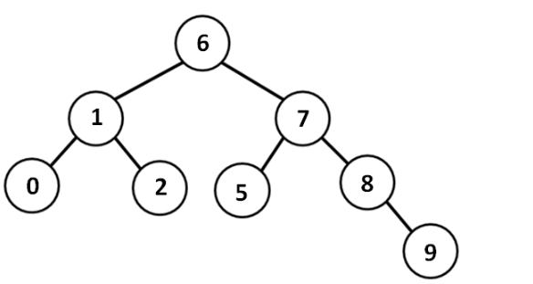

# Implementação de uma árvore binária com inserção ordenada a partir dos dígitos do número de RA.
Existem várias formas de se implementar uma árvore binária. A mais simples delas é usar um vetor de nós. Dessa forma, cada nó possui pelo menos três valores: uma referência para o pai do nó, uma referência para o filho à esquerda do nó e mais uma outra referência para o filho à direita do respectivo nó. O atributo "pai" vai apontar para a posição na qual o pai do nó se encontra, no vetor. O atributo "esquerda" vai armazenar a posição da raiz da sub-árvore à esquerda do nó, e o atributo "direita" guarda a posição da raiz da sub-árvore direita do nó, no vetor. Além disso, é relevante estabelecer um atributo "dado" que irá armazenar o conteúdo do nó.

É possível adicionar algumas regras à inserção de dados em uma árvore para que ela se torne ordenada. Assim, sempre que um novo dado estiver para ser adicionado junto à árvore, ele será comparado com o nó raiz. Se ele é menor do que a raiz, deverá ser adicionado na sub-árvore esquerda, caso contrário na sub-árvore direita.

Considere que, no seu primeiro estágio, ao realizar um teste no seu programa que implementa árvores binárias, você inseriu os números de seu RA (da esquerda para a direita) como se cada algarismo fosse um nó na árvore. Dessa forma, altere o código-fonte dado para que seu programa, durante a execução, monte uma árvore binária a partir dos dígitos de seu RA. O seu programa não deve realizar a inserção automaticamente ordenada, ou seja, não é preciso desenvolver um método que realize a inserção ordenadamente. Você mesmo pode construir a árvore (via inserções simples, porém seguindo as regras de inserção ordenada), de maneira a compor a árvore ordenada com os números de seu RA. Além disso, você precisará criar uma função que seja capaz de realizar o percurso pré-ordem na árvore recém-criada, partindo da raiz e imprimindo na tela os nós visitados de acordo com esse método.

Por exemplo, considere que seu RA é igual a 61207895. Veja na figura abaixo como sua árvore ordenada deveria ser, bem como o resultado do caminhamento pré-ordem quando executado a partir da raiz da respectiva árvore:
